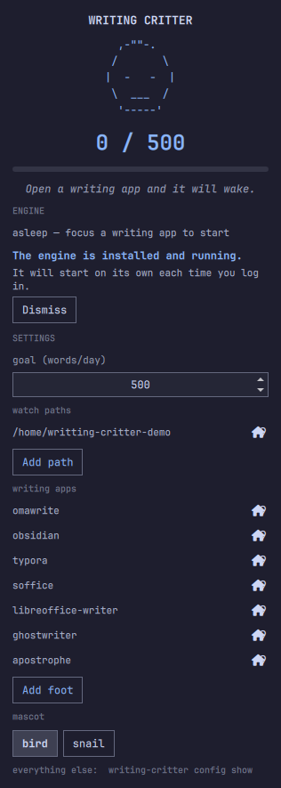

# Writing Critter

A small ASCII critter that lives in your [Omarchy](https://omarchy.org) topbar
and grows as you write toward a daily word goal.

```
  |  (o o)  |   0-24%     just an egg
  | ,(o o), |   25-49%    cracking
  | <(o o)> |   50-74%    stubby wings
  | \(o o)/ |   75-99%    wings out
  |~\(o o)/~|   100%+     soaring
```

Focus your editor and it wakes up. Focus anything else and it sleeps — eyes
closed, timer stopped, costing nothing. Click it for the full-size critter, your
progress, and a streak of the last seven days.

```
   \(o o)/  412/1000          ,-""-.
                             /       \
   right-click for           |  o   o  |
   quick actions              \  ___  /
                               '-----'
                              412 / 1000
                          ▓▓▓▓▓▓▓▓░░░░░░░░
                        "The shell is thinning."
```

## Preview

The captures below use a narrow demonstration path. No document titles or
writing history are displayed; the panel shows the installed engine waiting for
a configured writing app to receive focus.




> ## ⚠️ Pre-release — counting works, live soak still owed
>
> On 2026-09-02 this plugin **segfaulted `quickshell` in a crash loop**, taking
> the entire desktop shell down with it. That crash is diagnosed and its cause
> removed — see
> [docs/POSTMORTEM-ORPHANED-READ.md](docs/POSTMORTEM-ORPHANED-READ.md). All
> counting now happens in a separate process (`bin/writing-critter`); the widget
> only reads a small state file, with blocking reads from a singleton, so no
> async read can outlive a teardown.
>
> What is verified: the engine counts real writing in a real editor; the widget
> renders it; the shell survives a truncated, malformed, hostile, unknown-schema
> or entirely absent state file, recovering without a restart; and the engine's
> service management — install, update, repair, rollback, removal — is covered
> end to end against a scripted systemd.
>
> What is not: a long live soak. Until that is done, treat this as pre-release
> rather than something to depend on.
>
> To remove it, see [Removing it](#removing-it) — the engine is a user service
> and Omarchy runs no uninstall hook, so the order matters.

> **Status:** implemented. Passes `omarchy plugin validate`, the Qt 6 `qmllint`,
> 241 Python tests, 137 JavaScript tests, the QML lifecycle lint and the security
> guard; every service state has been reproduced against a real systemd user
> manager; and the setup card has been driven by hand in a live bar — see
> [Verification status](#verification-status).

## Requirements

Writing Critter was exercised on Omarchy 4.0.3-1 with Quickshell 0.3.1,
Python 3.14.7, and systemd 261. Those are the tested versions, not a claim of
minimum supported versions.

To run it, you need:

- Omarchy Quattro and its Quickshell bar.
- A Hyprland session with `hyprctl`, which the engine uses to learn which app
  has focus.
- Python 3. The bundled engine uses only Python's standard library.
- A working systemd user manager (`systemctl --user`) for the optional counting
  engine.
- Bash only if you use `install.sh` or `uninstall.sh` in a terminal; the panel
  does not use those wrappers.

For contributors, the [Development](#development) checks also use Node.js,
the Qt 6 `qmllint`, and Omarchy's plugin validator.

## It does not read your keyboard

The obvious way to count words you type is to read the keyboard. On Wayland that
means raw access to `/dev/input`, which needs `sudo usermod -aG input $USER` — a
grant that is **not scoped to this plugin**. It hands *every* process you run
permanent keylogging ability over every application, passwords included. That is
an absurd price for a mascot, so this plugin does not pay it and never will.

Instead it watches the document files you point it at and diffs their word
counts. Writing apps autosave a couple of seconds after you stop typing, so this
is live in practice with no privilege at all.

### What it reads

- The document files under the paths **you** configure, to count their words.
- Its own state directory (below).
- The identifier of the currently focused window, to know when to wake up.

### What it never does

- **No keyboard or input-device access.** No `/dev/input`, no evdev, no
  libinput, no `input` group, ever.
- **No network access.** Nothing leaves your machine. There is no update check.
- **No privilege escalation.** No sudo, no polkit, no package manager, no
  root, no second shell process. Setup writes two files you own and starts one
  **systemd *user* service**, running as you — see
  [Setting up the engine](#setting-up-the-engine). Nothing here needs, asks
  for, or can obtain administrator access.
- **No storage of anything you write.** File text is counted in memory and
  discarded. State holds only integers, dates, and the paths you chose. Nothing
  you write is ever logged.

### What it runs

Two lists, because two processes are involved.

The **desktop shell** runs exactly one program: `bin/writing-critter`, the
engine that ships inside this plugin, from a QML singleton, with an argument
list built in `Control.qml` from a fixed table. No panel button, config value
or engine message can become part of a command line.

The **engine** runs exactly two: `hyprctl activewindow -j`, to learn which
window has focus at startup, and `systemctl --user` with one of eight verbs
(`show`, `daemon-reload`, `enable`, `disable`, `start`, `stop`, `restart`,
`reset-failed`) against one unit, `writing-critter.service`. No path is ever
passed to either of them.

`scripts/security-guard.sh` enforces all of the above in CI — both allowlists,
the absence of any shell, and the ban on input capture, network access and
privilege escalation. `tests/test_guard.py` breaks each rule on purpose and
asserts the guard rejects it, because a guard that only ever passes has not
been tested. A regression breaks the build.

### Where state lives

```
~/.config/writing-critter/
└── config.json    your settings; the engine is its only writer

~/.local/state/writing-critter/
├── state.json     today's total, goal, mascot, what the bar reads
└── tracking.json  per-file baselines and history
```

Delete those two directories to reset everything. Removing the engine does
**not** touch them — see [Removing it](#removing-it). The plugin never writes
your `shell.json`.

## Install

```bash
omarchy plugin add https://github.com/Acero-AD/omarchy-writing-pet.git --enable
```

Then click the critter in your bar. It will offer to set up its engine, and
after that ask you where you write.

## Setting up the engine

The counting runs in a separate process, outside the desktop shell, because an
earlier version did it inside `quickshell` and crashed the whole desktop. That
separation is not negotiable — but it does mean there is a second thing to
install, and Omarchy deliberately runs no install hook when it adds a plugin.
So a freshly added Writing Critter is a bar widget with nothing behind it.

Open the panel and it says so, and offers to fix it. Before anything happens
the panel dims and asks, in the same dialog Omarchy's own menu uses before
uninstalling something, naming every effect:

```
┌──────────────────────────────────────┐
│ Set up the engine?                   │
│                                      │
│ · Copies the engine to               │
│   ~/.local/bin/writing-critter       │
│ · Writes ~/.config/systemd/user/     │
│   writing-critter.service            │
│ · Enables and starts that service    │
│   as you — not as root               │
│ · No administrator access, no        │
│   network, no package manager        │
│ · Your settings, today's count and   │
│   your history are not touched       │
│                                      │
│                [ Cancel ] [ Install ]│
└──────────────────────────────────────┘
```

Nothing is written until you choose **Install**. **Cancel** is selected when the
dialog opens, so a stray Enter does nothing; Cancel, Escape and a click outside
the dialog all leave everything exactly as it was, and the panel stays open.
A path under your home folder is shown with `~`; a custom `XDG_CONFIG_HOME` is
shown in full, because the review has to name where the unit will really go.

The panel asks the engine what state it is in each time you open it, and offers
the one action that fits:

| What it found | What it offers |
|---|---|
| Nothing installed | **Review setup**, then the disclosure above |
| Installed, but older than this plugin | **Update and restart**, after a confirmation |
| Installed and current, not running | **Start engine** |
| Running but not publishing a count | **Restart engine** |
| Just started | waits, and checks again |
| Running and counting | nothing, apart from **Remove engine** under the engine line |

Start and restart do not ask for confirmation: they replace no file and remove
nothing, and a dialog for them would only teach you to dismiss dialogs.

When an action finishes, the panel says what it came to, and keeps saying it
until you press **Dismiss** or do something else — closing the panel, reopening
it, or opening it on another monitor all show the same result:

| You did | It says |
|---|---|
| First setup | The engine is installed and running, and will start each time you log in |
| Update | The engine was updated and restarted |
| Start / restart | The engine is running; counting resumes when a writing app has focus |
| Remove engine | What was removed, and that your settings, count and history were kept |

If anything fails, it says which step refused and why, leaves the rest of the
settings working, and shows the command to run yourself. An install that fails
part-way puts the previous engine back rather than leaving you with half of a
new one; if it could not restore the *service* as well, it says that
separately.

### The same thing from a terminal

`install.sh` and `uninstall.sh` are thin wrappers around the same code the panel
runs, so the two cannot disagree about what installing means:

```bash
./install.sh                          # or: bin/writing-critter service install
bin/writing-critter service status    # what is installed, and is it running
bin/writing-critter service restart
./uninstall.sh                        # or: bin/writing-critter service uninstall
```

Add `--json` to any `service` subcommand for the machine-readable object the
panel reads.

## Removing it

Omarchy runs no uninstall hook, so the engine has to go **before** the plugin —
afterwards the checkout that knows how to remove it is gone.

```bash
# 1. remove the engine and its user service (or use "Remove engine" in the panel)
~/.config/omarchy/plugins/io.github.acero-ad.writing-critter/uninstall.sh

# 2. then remove the plugin
omarchy plugin remove io.github.acero-ad.writing-critter --yes
omarchy-restart-shell
```

Removing the engine stops and disables the service and deletes exactly two
files: `~/.local/bin/writing-critter` and
`~/.config/systemd/user/writing-critter.service`. **Your settings, today's
count and your history stay**, so installing again later resumes rather than
restarts. To delete those too:

```bash
rm -rf ~/.config/writing-critter ~/.local/state/writing-critter
```

If you removed the plugin first, the service files are still there and still
named above — remove them by hand, or reinstall the plugin and use the panel.

## Configure

Open the panel and change what you need. Every control commits by invoking the
engine's own command, so the config file keeps exactly one writer and the shell
is not it.

| Control | What it does |
|---|---|
| **Goal** | A positive integer field. Type an exact value or use the arrows in steps of 10; rapid edits commit once after they settle. |
| **Watch paths** | Each folder listed with a remove button, plus **Add path**, which opens a directory browser starting at your home folder. You can navigate above it, so a vault under `/mnt` is reachable. |
| **Writing apps** | Each app listed with a remove button. |
| **Mascot** | `bird` or `snail`. |

Only the numeric goal is typed, and the field constrains it to the positive
integer range the engine accepts. Other values are selected. The identifier
your compositor reports for an application is usually not its name — Obsidian
is `md.obsidian.Obsidian` — so guessing it is hopeless and typing it is
error-prone. Instead the engine publishes the last application it saw and did
**not** count, and the panel offers it as a single button. Focus your editor,
open the panel, click once.

The same applies to folders: you browse to one and confirm it, so the engine
never receives a path you composed by hand.

### From a terminal

The panel is a front end to these; they remain the complete interface, and they
work with no shell running.

```bash
writing-critter config show
writing-critter config set-goal 800
writing-critter config set-mascot snail
writing-critter config add-path ~/notes
writing-critter config remove-path ~/notes
writing-critter config add-app md.obsidian.Obsidian
writing-critter config remove-app md.obsidian.Obsidian
writing-critter config set-poll 1
```

Changes made here appear in an open panel within a couple of seconds, and a
running engine picks them up without a restart.

### The config file

`~/.config/writing-critter/config.json`. Settings without a panel control are
edited here; the engine rejects a file it cannot parse rather than overwriting
it.

| Setting | Default | What it does |
|---|---|---|
| `goal` | `500` | Words per day |
| `watch` | `[]` | Absolute paths to count in, recursively |
| `extensions` | `[".md", ".txt"]` | File types counted |
| `whitelist` | `omawrite, obsidian, typora, soffice, libreoffice-writer, ghostwriter, apostrophe` | Apps that wake the critter. Matched on whole dot-separated segments, so `obsidian` matches `md.obsidian.Obsidian`. |
| `mascot` | `bird` | `bird` or `snail` |
| `graceSeconds` | `15` | Keep counting this long after focus leaves, so an autosave that lands just after you alt-tab still counts |
| `pollSeconds` | `1` | Scan interval, clamped 1–30. Half of the delay between saving and seeing the count move; the widget's own poll of `state.json` is the other half, and the two are in series. |
| `lookbackSeconds` | `3` | Modification window per scan; always at least one poll longer than `pollSeconds` |
| `recountCap` | `200` | Most files re-read in a single cycle |
| `netMode` | `additive` | `net` makes deletions subtract |

### Display options

Two widget-level settings live in the plugin's entry in
`~/.config/omarchy/shell.json`, because they are about the bar rather than the
count:

```json
{
  "id": "io.github.acero-ad.writing-critter",
  "showNumbers": true,
  "idleNudge": true
}
```

`showNumbers` shows `412/500` beside the critter; `idleNudge` shows the `z` when
it is asleep. On a vertical bar the numbers move to the tooltip regardless.

## How it works

Every second, **and only while a configured writing app is focused**, a
metadata-only scan looks for recently modified files, then re-counts *only
those*. Idle ticks read nothing at all.

```
             300 notes    2000 notes
full recount     8 ms         38 ms     <- what we don't do
metadata probe   3 ms          3 ms     <- what we do (idle tick)
probe + 1 file   4 ms          5 ms     <- after you save
```

Cost is flat regardless of how big your collection gets, because it is
proportional to what you *wrote*, not what you *own*.

Two rules keep the count honest:

- **Adding a folder never inflates today.** A newly seen file records a baseline
  and contributes zero.
- **Deleting never takes back progress.** Cut a paragraph and the number holds.
  A counter that falls when you edit teaches you not to edit.

## Scope and known limits

- **GUI writing apps only.** Built for editors that autosave — Omawrite,
  Obsidian, Typora, LibreOffice Writer.
- **Terminal and modal editors are not supported.** nvim, helix and emacs save
  only on command, and normal-mode navigation is not writing. Use a companion
  source if you want them covered.
- **Binary formats (.odt, .docx) are not counted.** Write markdown or plain
  text, or install a LibreOffice companion.
- **CJK counting is approximate.** Each CJK character counts as one word, which
  overshoots, because those scripts do not delimit words with spaces.
- **The whitelist is load-bearing.** If your editor is not in it, the critter
  never wakes. That is the most likely thing to go wrong.

## Companion sources

Editors can report exact real-time counts by dropping a small JSON file into the
state directory. The protocol is documented in
[docs/COMPANION_PROTOCOL.md](docs/COMPANION_PROTOCOL.md) — implement it in any
language without touching this plugin.

## Development

```bash
node --test tests/*.test.mjs                          # 137 tests, no dependencies
python3 -m unittest discover -s tests -p 'test_*.py'  # 238 tests, stdlib only
./scripts/qml-lifecycle-lint.py                       # the postmortem's rules
./scripts/security-guard.sh                           # privacy + both allowlists
omarchy plugin validate .
qs=$(mktemp -d) && ln -s "$OMARCHY_PATH/shell" "$qs/qs" \
  && /usr/lib/qt6/bin/qmllint -I "$qs" *.qml         # see below — not plain `qmllint`
```

About that last line. On Arch, `qmllint` on the `PATH` is the **Qt 5** one
from `qt5-declarative`: it checks syntax only, and it passes a property that
does not exist. Quickshell is Qt 6, so the linter that actually type-checks
this plugin is `/usr/lib/qt6/bin/qmllint`. It also needs `qs.Ui` and
`qs.Commons` to resolve, which means a directory named `qs` pointing at the
shell — hence the temporary link, kept out of the repository because this
plugin ships no symlinks. Even then it exits 0 with warnings, so read them.

Expect about a hundred warnings that are not bugs: members reached through
objects the shell declares only as `QtObject` (`root.bar.fontFamily`,
`Style.font.body`, a `Loader`'s `item`), unqualified access in older Repeater
delegates, and the `QProcess::ExitStatus` one documented in `Control.qml`.
Anything else is worth reading.

`Model.js` holds every pure function — counting, baselines, rollover, stage and
mood, art assembly, source validation, the setup state machine, and the command
queue — so the logic most likely to be wrong is covered by fast tests instead of
needing a running shell. The mascot grid invariant is asserted across every set,
stage and mood; misaligned ASCII is the most visible way this plugin can look
broken.

That split is forced, not stylistic. Quickshell ships only `.qmltypes` and links
its plugin into the `quickshell` binary, so `qmltestrunner` cannot instantiate
anything that imports Quickshell — there is no way to test `Control.qml` as
`Control.qml`. Whatever stays in there is verified by running a desktop and
looking at it. So the decisions where being wrong is expensive live in
`Model.js`: which argument list an action maps to, whether a second status probe
is worth spawning, whether two engine calls can overlap, and what a finished
process meant.

The engine's service management is tested the same way: `tests/test_service.py`
redirects every destination into a temporary directory and replaces systemd with
a fake, but only at the point where a process would be spawned — the real code
still builds the real argument lists, and the tests assert on those. The fake's
behaviour comes from output captured off a real systemd, kept in
`tests/fixtures_systemctl.py` with the reasoning that made it worth capturing.

Two of the guards here have failed open and been caught by their own probes, so
`tests/test_lint.py` and `tests/test_guard.py` break every rule deliberately and
assert the rejection. A rule with no probe is a rule nobody has tested.

## Updating

Updating this plugin updates *two* things, and they move independently.

**The shell side.** `omarchy plugin update` reloads the plugin, but **QML
singletons are cached for the life of the shell process**, and this plugin has
two of them: the state reader and the settings controller. A plugin update
therefore leaves the previously loaded ones running: the bar keeps whatever
behaviour it started with, no matter what the files on disk now say. This cost
an hour of chasing a bug that had already been fixed. So after updating:

```bash
omarchy-restart-shell
```

**The engine side.** The engine systemd runs is a *copy*, in `~/.local/bin`. A
plugin update changes the checkout and leaves that copy untouched, still
serving the old code. The panel now notices: it compares the installed engine
and unit byte for byte against the ones in the checkout, and if either differs
it says an update is available and offers **Update and restart**.

The comparison is on bytes, not version strings, so a development build or a
changed unit file counts as drift even when the version has not moved. And
nothing is replaced without you saying so — opening a panel never silently
swaps the engine underneath a running process.

## Verification status

| | |
|---|---|
| Unit tests, security guard, lifecycle lint, manifest | ✅ 241 Python, 137 JS, all passing |
| Counting real writing | ✅ verified in Typora and an Obsidian vault |
| Rollover, restart, restored baselines | ✅ covered by tests and a live restart |
| Live bar rendering | ✅ the critter renders from the state file |
| Malformed / absent state file | ✅ shell survives truncated, non-object, hostile, unknown-schema and deleted; recovers with no restart |
| Engine setup, update, repair, removal | ✅ every state and transition, through the real CLI in an isolated home, against a scripted systemd |
| Rollback of a failed install | ✅ files and prior running state restored; rollback failure reported separately |
| Setup preserves settings and history | ✅ asserted byte-for-byte across install, update, rollback and uninstall |
| `systemctl` behaviour the parser relies on | ✅ captured off systemd 261 on this host, kept as fixtures with the reasoning |
| All six states against a real systemd user manager | ✅ not-installed, update-available, stopped, starting, unhealthy and ready each reproduced and repaired on a live machine |
| Drift detection against a real installation | ✅ correctly reported an installed engine as outdated while both version strings read 0.1.0 |
| An update really replaces the running process | ✅ the service's MainPID changes; the old process does not survive the update |
| Rollback from a unit systemd will not run | ✅ install fails, both files are restored, and the service comes back on the previous engine |
| Setup card driven by hand in a live bar | ✅ detect, install, update, repair, uninstall and reinstall, all from the panel |
| Service mounting | n/a — the engine is a systemd user service, not a shell service |
| Shell stability under long use | ⚠️ shell PID unchanged so far; a proper soak is still owed |
| Keyboard, themes and bar layouts | ✅ exercised alongside the setup card |
| Marketplace preview | ✅ captured with demonstration data; re-review against the final runtime candidate |
| Marketplace submission | ⬜ pending |

The [release verification record](docs/RELEASE-VERIFICATION.md) separates
completed checks from the pending live stability gate; it does not claim
marketplace approval.

### For a marketplace reviewer

`omarchy plugin validate` checks the local manifest and plugin layout. The
Marketplace Automated Security Baseline is expected to report **installer**
and **service-management** capabilities for this repository; its actual report
is authoritative. Both capabilities are real and are the point of the setup
flow above; they are declared here rather than worked around.

What they cover, exactly:

- `install.sh` / `uninstall.sh`, which delegate to `bin/writing-critter service`.
- Two files written, at fixed paths under the invoking user's own `$HOME` and
  `$XDG_CONFIG_HOME`. Neither destination can be redirected by an argument, a
  config value, or anything the panel passes.
- One systemd **user** unit, enabled and started as that user.

What they do not cover, enforced by `scripts/security-guard.sh` in CI: no
`sudo`, no `polkit`, no package manager, no network, no download, no remote
code, no shell, no system-wide path, and no caller-supplied path on any command
line.

Design rationale and the full technical spec live in
[`writing-critter-spec.md`](writing-critter-spec.md) and
[`openspec/changes/archive/2026-09-03-add-writing-critter-plugin/`](openspec/changes/archive/2026-09-03-add-writing-critter-plugin/).

## Publishing

The marketplace submission draft and publishing checklist are in
[docs/MARKETPLACE-SUBMISSION.md](docs/MARKETPLACE-SUBMISSION.md) and
[docs/PUBLISHING.md](docs/PUBLISHING.md). They prepare a submission but do not
claim that this plugin has been listed or verified.

## License

MIT — see [LICENSE](LICENSE).
